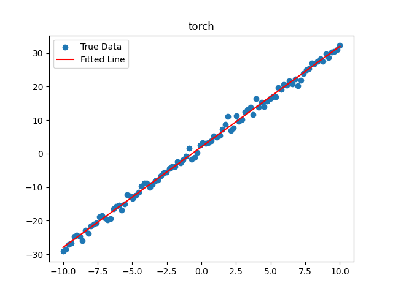
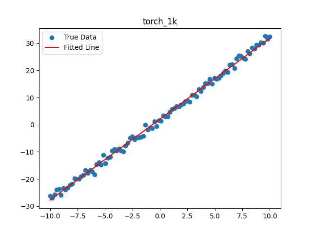

# torch-1k.py

Implementing PyTorch's core basic functions within 1000 lines of code
(For learning purposes only)

## Core Features
- [x] Tensor: element-wise add, subtract, multiply, divide
- [x] Tensor: scalar + Tensor support
- [x] Tensor: broadcasting across different dimensions
- [x] Autograd for functions and composite functions
- [ ] Common functions: sin, cos, exp, log, relu, softmax, etc.
- [x] Neural network `Module`
- [x] `Linear` operator
- [x] Optimizer: Adam algorithm
- [ ] MLP neural network: drop-in replace `torch` with `torch_1k` for MNIST classification

## Usage
### Installation
```
cd torch_1k
pip install .
```
### Code Demo
Example 2:
| Image 1 | Image 2 |
|---------|---------|
|  |  |

Simply replace `torch` with `torch_1k`, all other code stays the same (only a minimal subset of functions is implemented).
```
import matplotlib.pyplot as plt

############################
# change test parameters here
#use_torch_1k = False
use_torch_1k = True
############################
if use_torch_1k:
    import torch_1k as torch
    import torch_1k.nn as nn
    import torch_1k.optim as optim
    title = 'torch_1k'
else:
    import torch
    import torch.nn as nn
    import torch.optim as optim
    title = 'torch'

print('#####################################################')
print(f'### Using {title=} ..')
print('#####################################################')
# create dataset
torch.manual_seed(0)

# input data (100 samples)
X = torch.unsqueeze(torch.linspace(-10, 10, 100), dim=1)

# labels
true_w = 3
true_b = 2
y = true_w * X + true_b + torch.normal(0, 1, size=X.size())  # add noise

class LinearRegressionModel(nn.Module):
    def __init__(self):
        super(LinearRegressionModel, self).__init__()
        self.linear = nn.Linear(1, 1)

    def forward(self, x):
        return self.linear(x)

model = LinearRegressionModel()
# loss and optimizer
criterion = nn.MSELoss()
optimizer = optim.SGD(model.parameters(), lr=0.01)

# training
epochs = 1000
losses = []

for epoch in range(epochs):
    model.train()

    # forward
    y_pred = model(X)

    # loss
    loss = criterion(y_pred, y)
    losses.append(loss.item())

    # backward and optimize
    optimizer.zero_grad()
    loss.backward()
    optimizer.step()

    if (epoch+1) % 50 == 0:
        print(f'Epoch [{epoch+1}/{epochs}], Loss: {loss.item()}')

# evaluation
model.eval()
with torch.no_grad():
    predicted = model(X)

# plot
plt.scatter(X.numpy(), y.numpy(), label='True Data')
plt.plot(X.numpy(), predicted.numpy(), label='Fitted Line', color='r')
plt.title(title)
plt.legend()
plt.show()
```

Example 1:
```
import time
import numpy as np
import torch_1k
from torch_1k import functional as F
from torch_1k import Tensor
import matplotlib.pyplot as plt


def run():
    N = 200
    x = np.random.rand(N, 1)
    y_target = 3*x + 1 + 0.3*np.random.rand(N, 1)

    W = Tensor.zeros(1, 1).renamed('W')
    b = Tensor.zeros(1, 1).renamed('b')

    def model(x):
        z = F.matmul(x, W).renamed('z')
        y =  z + b
        return y

    def mean_squared_error(predict, target):
        dif = predict - target
        err = F.sum(dif**2) /dif.shape[0]
        return err

    lr = 0.1
    epochs = 1000

    for i in range(epochs):
        y_pred = model(x)
        loss = mean_squared_error(y_pred, y_target)

        W.zero_grad()
        b.zero_grad()
        loss.backward()
        W.data -= lr*W.grad.data
        b.data -= lr*b.grad.data
        if i % 100 == 0:
            print(f'{i}: loss={loss.data}, {W.data=}, {b.data=}')

    y_pred = model(x)
    plt.scatter(x, y_pred.data, color='g')
    plt.scatter(x, y_target, marker='x')
    plt.show()

if __name__ == '__main__':
    run()
```

## Notes
### Variable reuse is not allowed
The following code is incorrect:
```
    x = Tensor(2.0, name="x")
    x = x*x
    x.backward()
```

## References
- 《深度学习入门自制框架》
- PyTorch official repository: https://github.com/pytorch/pytorch
- Paszke, A. et al. (2019). PyTorch: An Imperative Style, High-Performance Deep Learning Library. *NeurIPS 2019*.

## ChangeLog
- [@2024-08-17] v0.0.1 create project
- [@2024-08-18] v0.0.2
- [@2024-08-19] v0.0.3 core features implemented: 1k core code, 1k test code
